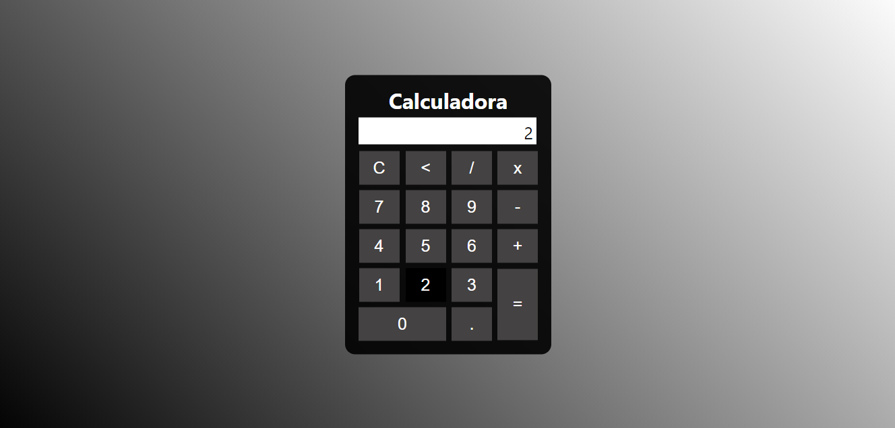

# Basic Calculator
Basic calculator made for treining. 

<h3>👨‍💻 Used Technology</h3>

- [HTML](https://www.w3schools.com/html/)
- [CSS](https://developer.mozilla.org/pt-BR/docs/Web/CSS)
- [JavaScript](https://developer.mozilla.org/en-US/docs/Web/JavaScript)

<!--License session-->
<h3>📝 License</h3>

- This project is under [MIT](./LICENSE.txt) license.

<!--Bottom session-->
 <h4 align=center>Made with by <a target="_blank" href="https://github.com/mariacpeixoto" >Maria Peixoto</a></h4>
